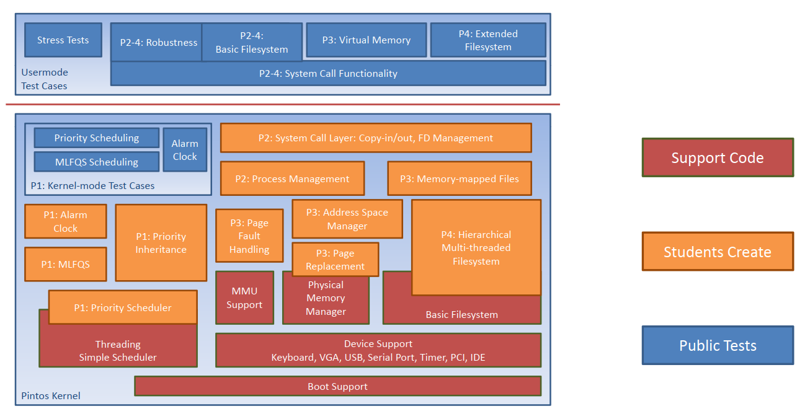

# Pintos

## About

PintOS is an open source instructional operating system kernel developed by Stanford University. PintOS provides complete documentation & modular projects to introduce students to the major concepts of operating systems development. The components of PintOS project is illustrated in the following figure.

## Installation Guidelines

To install PintOS please use the guidelines listed at the [installation document](Installation.md).

## Project Documents

The following is a list of the documents to explain and document the project and its requirements.

1. [PintOS Official Document](guides/PintOS&#32;Official&#32;Document.pdf): The main official documentation and project requirements compiled from PintOS repository provided by Stanford University.
2. [CSCI 350 - PintOS Guide](guides/CSCI&#32;350&#32;-&#32;Pintos&#32;Guide.pdf): A simple read for PintOS code and its requirement provided from [University of Southern California OS Course](http://bits.usc.edu/cs350/).

## Sessions' Videos

Here's a list of sessions I made (in Arabic) for Alexandria University, explaining PintOS & its phases requirements:

1. [Phase 1 Requirements](https://youtu.be/RLx_0nnEjaM)
2. [Phase 2 Requirements](https://youtu.be/bFUmvVgmbOs)
